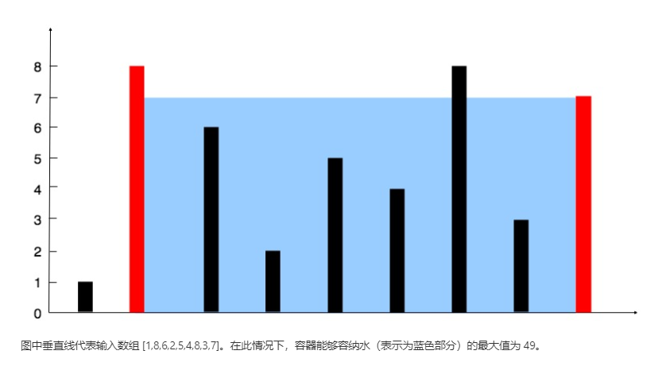

#### leetcode  [11. 盛最多水的容器](https://leetcode-cn.com/problems/container-with-most-water/)

**题意**

给你 n 个非负整数 a1，a2，...，an，每个数代表坐标中的一个点 (i, ai) 。在坐标内画 n 条垂直线，垂直线 i 的两个端点分别为 (i, ai) 和 (i, 0)。找出其中的两条线，使得它们与 x 轴共同构成的容器可以容纳最多的水。

**说明**

你不能倾斜容器，且 *n* 的值至少为 2。



**示例**

```c
输入：[1,8,6,2,5,4,8,3,7]
输出：49
```

**题解**

&emsp;&emsp;由题意可知我们需要找出储水量的最大值，也就是体积的最大值，进而演化成 X*Y轴的最大值，所以我们定义两个指针分别从 左边或右边相向而行，直到撞击为止，在扫描的过程中找到y周的最小值乘以这两堵墙之间的距离赋值给$area,依次循环如果`$height[$l] < $height[$r]`则 $l++,否则`$r--`，$area取两次结果的最大值最后得到的$area就是需要的最大值。

****

**代码：**

```PHP
function maxArea($height) {
    $l=0;
    $r=count($height);
    $area = 0;
    while ($l<$r){
        $area=max($area,min($height[$l],$height[$r])*($r-$l));
        if ($height[$l] < $height[$r]) {
            $l++;    
        } else {
            $r--;
        }
    }
    return $area;
}
```