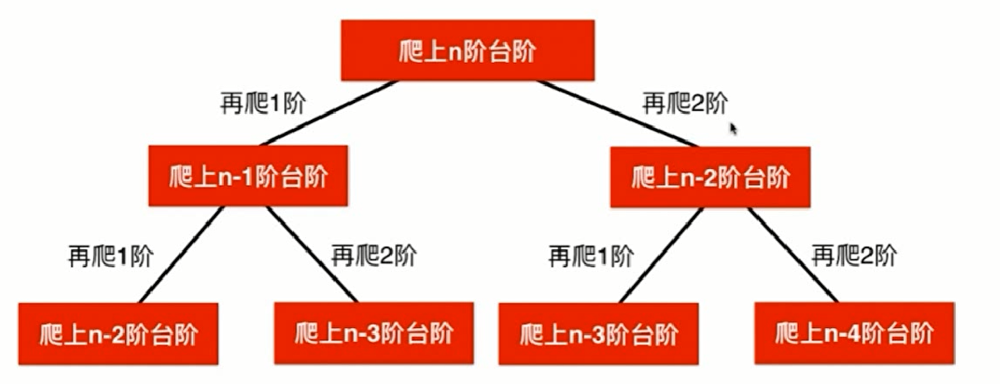

#### leetcode 70-爬楼梯

**题意**
假设你正在爬楼梯。需要 *n* 阶你才能到达楼顶。
每次你可以爬 1 或 2 个台阶。你有多少种不同的方法可以爬到楼顶呢？
**注意：**给定 *n* 是一个正整数。

**示例1**

```c++
输入： 2
输出： 2
解释： 有两种方法可以爬到楼顶。
1.  1 阶 + 1 阶
2.  2 阶
```

**示例2**

```c
输入： 3
输出： 3
解释： 有三种方法可以爬到楼顶。
1.  1 阶 + 1 阶 + 1 阶
2.  1 阶 + 2 阶
3.  2 阶 + 1 阶
```

**题解**

&emsp;&emsp;下面我们自顶向下的分析一下，如果我们想要爬上第`n`阶台阶的话，有两种可能从`n-1`台阶爬一阶，或这从`n-2`阶台阶爬两阶。因此我们就把问题转换为爬`n-1`阶台阶有多少种方法爬`n-2`有多少种方法的和，由此我们在计算爬上`n-1`阶台阶有多少种方法，也就是`n-2`台阶加上`n-3`阶台阶的和；同理爬上`n-2`阶台阶有多少种方法就需要计算爬上`n-3`和`n-4`台阶的和以此类推。把一个大问题转换成一个小问题进而转换成成一个更小的问题，解决最终的问题。最后形成如下图所示的递归树。



下面将是这个递归具体的实现代码：

```php
function climbStairs2($n) {
   if($n==0||$n==1){
       return 1; //当n==0 时有一种可能
   }
    return $this->climbStairs2($n-1)-$this->climbStairs2($n-2);
}
```

而对于上图中，对爬`n-2`阶台阶有多少种方法，和`n-3`阶台阶有多少种方法都有重复的出现，如果这个树继续往下画的话这种重叠的情况是非常多的，这样对内存的消耗是巨大的。

**使用记忆化搜索进行优化**

```PHP
class Solution {
    /**
     * @param Integer $n
     * @return Integer
     */
    private $memo=[];
    function climbStairs2($n) {
    if($n==0||$n==1){
         return 1; //当n==0 时有一种可能
     }
     if(empty($this->memo[$n]))
      $this->memo[$n]=$this->climbStairs2($n-1)+$this->climbStairs2($n-2);
      return $this->memo[$n];
    }
}
```

如上面的代码所示：将计算过的值存入memo中，如果有值直接返回，否则计算完之后存入memo中在进行返回，这样内存空间得到了很大的优化。

**动态规划解决问题**

&emsp;&emsp;通过上边的问题拆分，我们很容易想到利用动态规划来解决这个问题，从上面的递归思想我们都是自上而下的思想解决换句话说我们并没有从最基本的问题开始解决而是认为最基本的问题已经得到解决，进而解决更大的问题，而动态规划，则是自下而上的解决问题，我们先解决小数据量下这个数据的结果为多少，之后层层的递推，对于更大的数据量而言这个数据的结果是怎样的，通常这个过程就被称之为动态规划。

**代码的实现**

```php
function climbStairs($n) {
    $arr[0]=1;
    $arr[1]=1;
    for($i=2;$i<=$n;$i++){
        $arr[$i]=$arr[$i-1]+$arr[$i-2];
    }
    return $arr[$n];
}
```